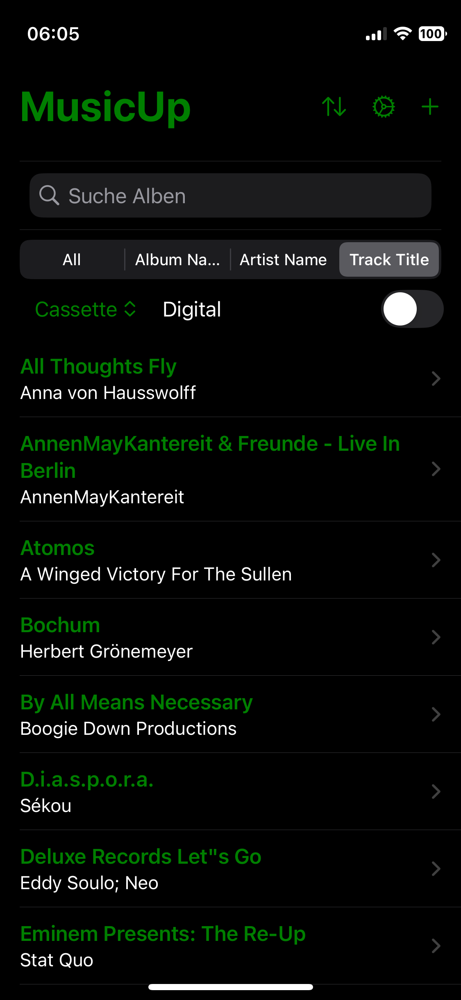
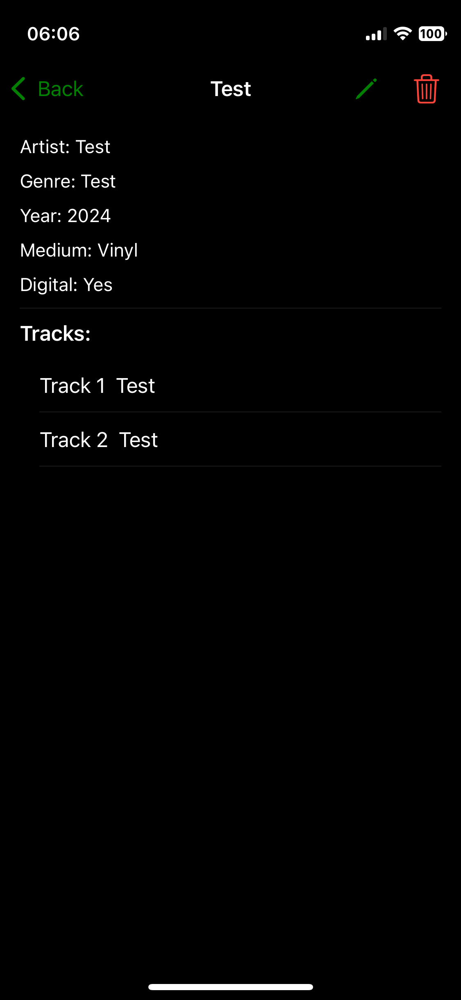
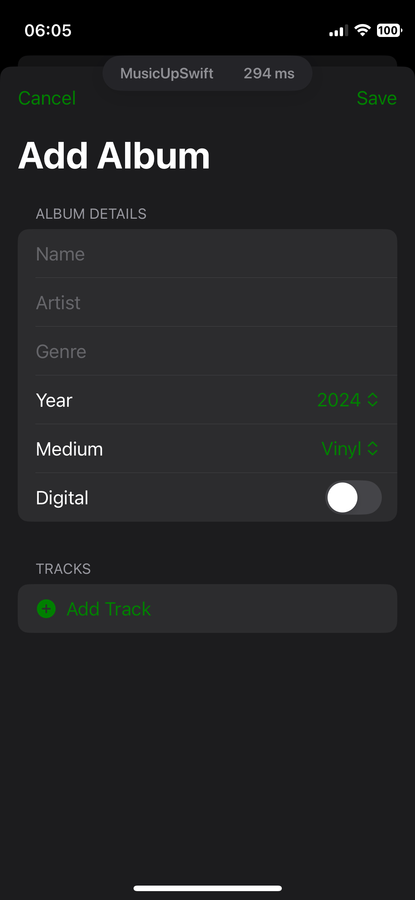
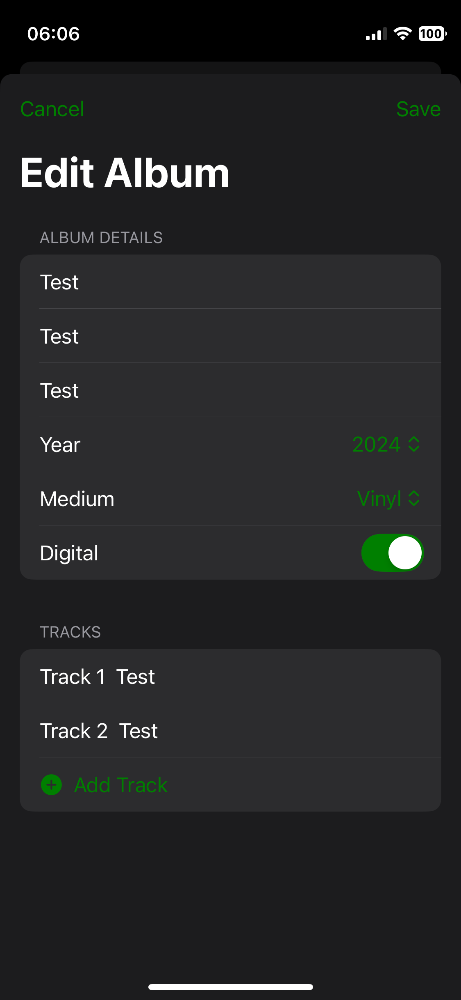
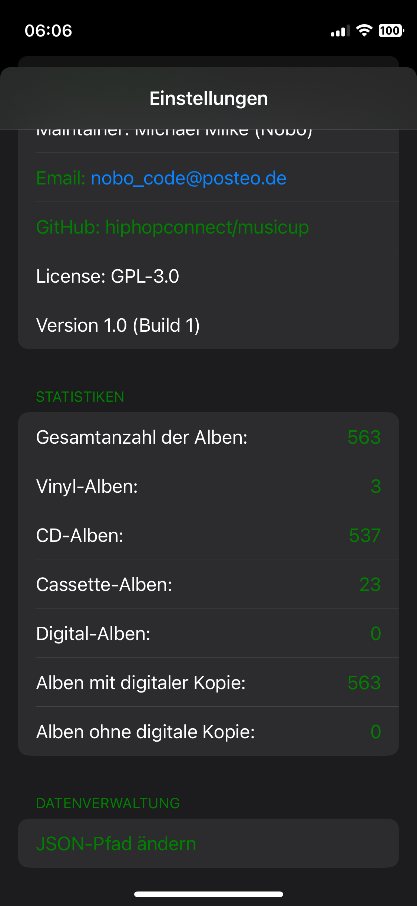

# MusicUp


**MusicUpSwift** is a SwiftUI-based application designed to help users manage their extensive music collections efficiently.
Whether you're a music enthusiast organizing your CDs and vinyls or an artist managing your discography, MusicUpSwift offers
a seamless experience for importing, exporting, and maintaining your album data.

## Table of Contents

- [Features](#features)
- [Screenshots](#screenshots)
- [Installation](#installation)
- [Packaging for Debian](#packaging-for-debian)
- [Usage](#usage)
- [Testing](#testing)
- [Motivation](#motivation)
- [Contributing](#contributing)
- [License](#license)
- [Contact](#contact)

## Features

- **Add Albums:** Easily add new albums with details such as name, artist, genre, year, medium, and digital
  availability.
- **Edit Albums:** Modify existing album information to keep your collection up-to-date.
- **Search & Filter:** Quickly find albums using search and filter functionalities.
- **User-Friendly Interface:** Intuitive design for effortless navigation and management.

## Screenshots



*Main Screen displaying a list of albums.*




*Album View displaying information of one Album.*



*Add Album screen with form fields.*



*Edit Album screen with form fields.*



*Settings Screen where you can define the JSON Path, view information on media types, maintainer, version, etc.*

## Installation

### Prerequisites

- **XCode:** Ensure you have XCode installed. Download it from Mac App Store.
- **Swift 5.0** Comes bundled with XCode.
- **Git:** To clone the repository.

### Steps

1. **Clone the Repository:**

    ```bash
    git clone https://github.com/hiphopconnect/musicup-swift.git
    cd musicup-swift
    ```

2. **Open the Project in XCode**

    ```bash
    open MusicUpSwift.xcodeproj
    ```
    
## Usage

Once the app is running:
* Add Albums: Tap the "+" button to add a new album.
* Edit Albums: Swipe left on an album in the list to reveal the "Edit" option.
* Delete Albums: Swipe left on an album in the list to reveal the "Delete" option.
* Search & Filter: Use the search bar and filters at the top to find specific albums.
* Select JSON File: Go to the settings screen by tapping the gear icon, and select a JSON file to load album data.

## Testing

You can run the tests for **MusicUpSwift* using XCode's built-in testing framework. To run all tests.

Open the Test Navigator by pressing Command + 6 in Xcode.
Click the Run button next to MusicUpSwiftTests to execute all unit tests.
For UI tests, run the tests under MusicUpSwiftUITests.

Alternatively, you can run all tests using the Product menu:

   ```bash
   git clone https://github.com/hiphopconnect/musicup-swift.git
   cd musicup-swift
   ```

   ```bash
    Product > Test
   ```
    
This will execute all unit and UI tests available in the repository.

## Motivation

The idea for **MusicUpSwift** came from my personal need to organize a large collection of CDs and vinyl records. Initially,
I used a paid app that allowed scanning albums, but it often failed to find certain CDs, requiring manual entries. As a
result, I decided to build **MusicUpSwift**, focusing on ease of use and customization. Scanning is a feature I may consider
adding in the future, but for now, manual input is still a reliable option.

## Contributing

Contributions are welcome! If you have ideas or improvements, feel free to fork the repository and submit a pull
request. Make sure to follow best practices when contributing.

## Project Background

I also have a repository with a Flutter version of this software, which I originally developed on Linux Mint. My initial thought was, "Great! Just one codebase, and I can publish on all platforms." However, I quickly ran into dependency issues that became difficult to resolve.

As a result, I developed the mobile version of the software for my iPhone in Swift.

### Future Plans

1. A Kotlin version for Android.
2. A Flutter version for Android, iOS, Windows, and Mac.
3. Adding a scanner to load data from a database like CDDB.


## License

**MusicUp** is licensed under the **GNU General Public License v3.0** - see
the [LICENSE](https://www.gnu.org/licenses/gpl-3.0.html) file for details.

### Key points of the GNU GPLv3:

- **Freedom to use, modify, and distribute**: You are free to use, modify, and distribute this software, as long as you
  adhere to the GPLv3 conditions.
- **Copyleft**: Any modifications or derived works must also be distributed under the GPLv3 license.
- **Source code availability**: If you distribute the software, you must make the full source code available, including
  any modifications.
- **Patent protection**: The license prevents any patent claims against users of the software.
- **No "Tivoization"**: Hardware that uses GPLv3 software must allow installation of modified software by users.

For more information, please refer to the [official GPLv3 license](https://www.gnu.org/licenses/gpl-3.0.html).

## Contact

For any inquiries or feedback, feel free to contact me
at [Nobo](mailto:nobo_code@posteo.de?subject=[GitHub]%Source%20MusicUP).
 
